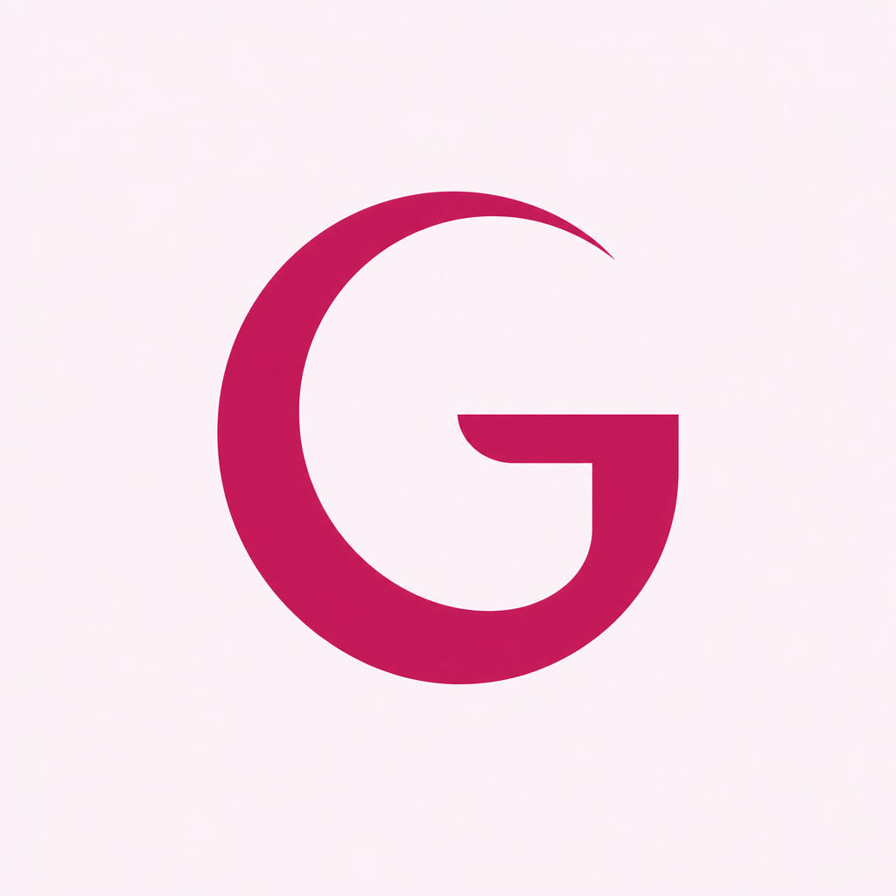

<p align="center">
  
  <h1>GirlCode360</h1>
</p>

<h1 align="center">Cycle, skin, and style in one signed-in PWA</h1>

<p align="center"><em>Women’s wellness companion for UK, Nigeria, and Ghana</em></p>

<p align="center">
  GirlCode360 is one Cognito account: period and symptom logging, PMOS Manager,
  pregnancy and TTC, a Health Wallet, Alena on Bedrock, and Mirror (Perfect Corp YouCam
  Skin AI plus apparel try-on). Beauty is optional. The diary is not.
</p>

<p align="center">
  <code>Home · Cycle · Mirror · Alena · Account</code>
</p>

<p align="center">
  <code>Custom Cognito · Aurora DSQL · YouCam S2S · Nova 2 Lite · PWA</code>
</p>

<p align="center">
  <code>AWS eu-west-2 · Terraform · CodePipeline · Node 22</code>
</p>

<p align="center"><strong>Built for the YouCam API Skin AI &amp; Apparel VTO hackathon, on the production stack</strong></p>

<p align="center">
  
  
  
  
  
  
</p>

<p align="center">
  <a href="https://girlcode.rinegansolutions.com">Website</a>
  ·
  <a href="https://girlcode.rinegansolutions.com/privacy">Privacy</a>
  ·
  <a href="./docs/new/girlcode-imp-plan.md">Implementation plan</a>
</p>

```bash
cd apps/web
cp .env.example .env   # fill Cognito + API, or YOUCAM_API_KEY for local Mirror
npm ci --include=dev
npm run dev            # http://localhost:5173
```

## What this is

GirlCode360 is a mobile-shell PWA (`apps/web`), not Amplify, not Cognito Hosted UI. Auth pages are custom (`amazon-cognito-identity-js`). Phone chrome is five tabs. Desktop adds Health, Library, Community, and Marketplace in the sidebar. `apps/admin` is an ops scaffold and is not in the current sprint.

Mirror is the YouCam surface. Skin analysis and apparel VTO share one studio with makeup, hair, wardrobe, and accessories. Stills go to our API. Lambda is the only caller of YouCam. Cycle day at capture is ours. YouCam never sees the diary. Wellness copy only: no diagnosis.

| Surface | URL | Notes |
| --- | --- | --- |
| Prod web | https://girlcode.rinegansolutions.com | S3 + CloudFront |
| Prod API | https://api.girlcode.rinegansolutions.com | API Gateway + Lambda |
| Nonprod web | `girlcode-dev` / `girlcode-test` on the same apex | Path-filtered pipelines |
| Privacy / terms | `/privacy`, `/terms` on the marketing site | Separate from signup |

Hackathon topic: [Skin AI + Apparel VTO](https://youcam-api.devpost.com/) (combined).

## Architecture in one page

The browser holds Cognito tokens and never holds `youcam_api_key`.

```
PWA (Vite)  --JWT-->  API Gateway /v1/*
                         │
                         ▼
              Lambda handlers (Node 22)
                 │         │         │
            Aurora DSQL   S3/KMS   Secrets Manager
                 │         │         │
              cycle/PMOS   scan      youcam_api_key
              Alena quota  bytes     packed JSON
                         │
                         ▼
              YouCam S2S  (skin-analysis, cloth-v3, …)
                         │
              poll our GET · copy result to S3 · DELETE YouCam file
```

| Concern | Choice |
| --- | --- |
| Auth | Cognito User Pool, custom pages, optional Google IdP |
| App | React 19, Vite 8, Tailwind, PWA (`vite-plugin-pwa`) |
| API | REST `/v1/*`, one gateway, many Lambda handlers |
| Data | Aurora DSQL (`pg` + DSQL signer) |
| Beauty | YouCam `POST/GET /s2s/v2.0/task/{capability}` from `infra-backend/.../lib/youcam.ts` |
| Assistant | Amazon Nova 2 Lite on Bedrock (`packages/ai-provider`) |
| Config | SSM `/girlcode360/{env}/…` · secrets in `girlcode360/{env}/app` |
| Web host | `girlcode360-web-{env}` + CloudFront invalidation `/*` |

YouCam create returns **pending** when the task is still running (API Gateway ~29s). The client keeps the still on stage and polls **our** GET. Result URLs from YouCam last about two hours; we copy to S3 first. Webhooks (`POST /v1/webhooks/youcam`) are optional. Client photo errors do not open the outage circuit. Five real upstream failures do; Cycle and Alena stay up.

Detail: [docs/new/girlcode-imp-plan.md](./docs/new/girlcode-imp-plan.md) §5. Mirror spec: [docs/new/girlcode-mirror-spec.md](./docs/new/girlcode-mirror-spec.md).

## Repo layout

```
girlcode360/
├── apps/web/                 # Vite PWA (marketing + /app)
├── apps/admin/               # Ops/content scaffold (LATER)
├── packages/domain/          # Shared types, YouCam error mapping, copy
├── packages/api-types/       # HTTP contracts
├── packages/ai-provider/     # Bedrock / Nova
├── infra-backend/            # Terraform: Cognito, APIGW, Lambda, DSQL, S3
│   └── modules/lambda/codes/ # Handlers + youcam.ts
├── infra-web/                # Terraform: S3, CloudFront, ACM, Route 53
├── ci-cd/                    # CodePipeline CloudFormation
│   ├── infra-web-pipeline.yaml
│   └── infra-backend-pipeline.yaml
├── docs/new/                 # Current PRD, impl plan, Mirror, hackathon
├── docs/old/                 # Superseded drafts
├── docs/ops/                 # Runbooks, PWA QA, clinical/legal checklist
└── load/                     # Load helpers
```

There is no root npm workspace. Install inside `apps/web` and `infra-backend/modules/lambda/codes`.

## CI/CD

Two **CodePipeline V2** stacks (GitHub via CodeConnections), not GitHub Actions. YAML in git does not change live pipelines until the CloudFormation stack is updated.

| Pipeline | Branch | Path includes | What it deploys |
| --- | --- | --- | --- |
| Web nonprod | `develop` | `apps/web/**`, `packages/**`, `infra-web/**`, `ci-cd/infra-web-pipeline.yaml` | Terraform web + `apps/web/buildspec.yml` → S3 + CloudFront |
| Web prod | `main` | same | Prod web (manual approval) |
| Backend nonprod | `develop` | `infra-backend/**`, `packages/**`, `ci-cd/infra-backend-pipeline.yaml` | Terraform + Lambda |
| Backend prod | `main` | same | Prod API (manual approval) |

Other branches and paths (for example `docs/**` only) do not start a run. Nonprod web still waits on **ApproveDevDeploy** before apply and the web build. Do not `terraform apply` from a laptop unless you intend to bypass that path.

## Prerequisites

- Node.js 22 (`engines` in `apps/web` and the Lambda package)
- AWS account in **eu-west-2** (Cognito, DSQL, Lambda, S3, Secrets Manager, Bedrock)
- Cognito user pool + app client (localhost is an allowed callback for local sign-in)
- For Mirror locally: Perfect Corp YouCam key as `YOUCAM_API_KEY` in `apps/web/.env` (never `VITE_`). Vite then talks S2S from the dev server. Production key lives in Secrets Manager as `youcam_api_key` (or `YOUCAM_API_KEY`) inside `girlcode360/{env}/app`.

## Quick start (from source)

**PWA**

```bash
cd apps/web
cp .env.example .env
# Set VITE_COGNITO_* and VITE_API_BASE_URL to hit deployed API,
# or set YOUCAM_API_KEY for local Mirror without that proxy.
npm ci --include=dev
npm run dev
```

With `VITE_API_BASE_URL` and no local YouCam key, Vite proxies `/v1` to that API. With `YOUCAM_API_KEY`, local YouCam middleware handles Mirror/guest Alena on the dev server and the Cognito proxy is skipped.

**Lambda (typecheck + tests)**

```bash
cd infra-backend/modules/lambda/codes
npm ci
npm test
npm run typecheck
```

**Do not commit** `.env`, YouCam keys, Cognito passwords, or wallet passphrases.

Per-app notes: [apps/web](./apps/web) (Vite template README is still the scaffold default). Ops: [docs/ops/runbooks.md](./docs/ops/runbooks.md).

## Documentation

| Document | Description |
| --- | --- |
| [docs/new/girlcode-prd.md](./docs/new/girlcode-prd.md) | Product requirements |
| [docs/new/girlcode-imp-plan.md](./docs/new/girlcode-imp-plan.md) | Current implementation plan (source of truth) |
| [docs/new/girlcode-mirror-spec.md](./docs/new/girlcode-mirror-spec.md) | Mirror / YouCam epic |
| [docs/new/girlcode-ai-feature-spec.md](./docs/new/girlcode-ai-feature-spec.md) | Alena and HealthLens |
| [docs/new/girlcode-roadmap.md](./docs/new/girlcode-roadmap.md) | Roadmap |
| [docs/new/hackathon-submission.md](./docs/new/hackathon-submission.md) | Devpost story |
| [docs/ops/clinical-legal-checklist.md](./docs/ops/clinical-legal-checklist.md) | Wellness vs clinical language |
| [docs/old/](./docs/old/) | Archived drafts (do not treat as current) |

## Licence

No `LICENSE` file is in this tree. Treat the repository as proprietary unless the owner adds terms. Third-party: Perfect Corp YouCam is used under their API terms; Amazon services under AWS terms.
